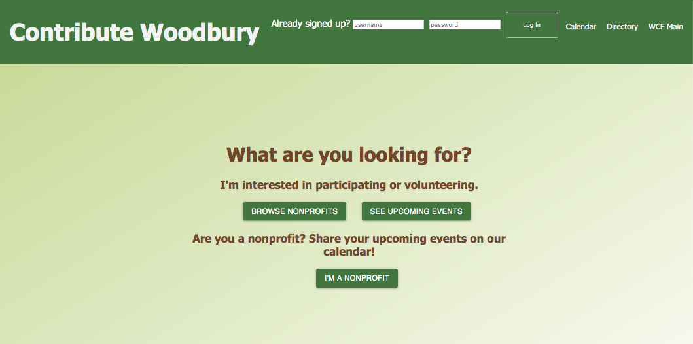
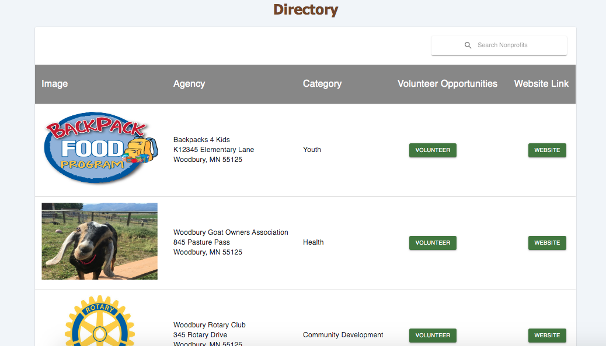

# Contribute Woodbury

Before Contribute Woodbury, there was no central hub for Woodbury citizens finding a list of nonprofit events in the Woodbury Community.  Contribute Woodbury is a full stack web application that will allow nonprofit organizations to create a “profile” and add events for volunteers to find and sign up for.  This application will keep track of nonprofits who have signed up as well as which visitors have volunteered for which events in a specific role.
[Heroku Link](https://lit-inlet-59401.herokuapp.com/#/home)

## Built With
- React 
- Redux 
- Redux-Saga
- Express 
- pg
- Passport 
- PostgreSQL 
- Moment
- Cloudinary
- Material-UI
- Sweetalert2
(a full list of dependencies can be found in `package.json`).

## Getting Started

These instructions will get you a copy of the project up and running on your local machine for development and testing purposes. See deployment for notes on how to deploy the project on a live system.

### Prerequisites

Link to software that is required before you attempt to start the app (e.g. node, mongo).

- [Node.js](https://nodejs.org/en/)
- [Nodemon](https://nodemon.io/)
- [PostrgeSQL](https://www.postgresql.org/)
- HomeBrew or equivalent


### Installing

Steps to get the development environment running.

1. Download this project.
2. `npm install`
3. Create a `.env` file at the root of the project and paste this line into the file:
    ```
    SERVER_SESSION_SECRET=superDuperSecret
    ```
    While you're in your new `.env` file, take the time to replace `superDuperSecret` with some long random string like `25POUbVtx6RKVNWszd9ERB9Bb6` to keep your application secure. Here's a site that can help you: [https://passwordsgenerator.net/](https://passwordsgenerator.net/). If you don't do this step, create a secret with less than eight characters, or leave it as `superDuperSecret`, you will get a warning.
4. Start postgres if not running already by using `brew services start postgresql`
5. Create a database called `woodbury` and follow instructions in database.sql file
5. `npm run client`
6. `npm run server`
7. Navigate to `localhost:3000`

## Screen Shot

### Landing Page


### Directory


### Nonprofit Home Page


## Documentation

[Instruction Manual](https://docs.google.com/document/d/1OoMvo5TmFI8Na4KvjQ3y4Z3gBfJ_0Uz0dyl7M1PS19I/edit?usp=sharing)

### Completed Features

High level list of items completed.

- [x] Nonprofit Registration
- [x] Event Creation
- [x] Volunteer Sign up
- [x] Calandar of Upcoming Events
- [x] Directory of Nonprofits
- [x] Navigation Bar
- [x] Automatic flagging of outdated nonprofits
- [x] Ability to delete old nonprofits

### Next Steps

Features that you would like to add at some point in the future.

- [ ] Automated deletion of old volunteer roles / nonprofits
- [ ] Automated emailing of approved and as new nonprofits
- [ ] Confirmation text or email sent upon volunteer sign up
- [ ] Allow Admin to add, change, or delete categories

## Deployment

Before pushing to Heroku (or other deployment system), run `npm run build` in terminal. This will create a build folder that contains the code Heroku will be pointed at. You can test this build by typing `npm start`. Keep in mind that `npm start` will let you preview the production build but will **not** auto update.

* Start postgres if not running already by using `brew services start postgresql`
* Run `npm start`
* Navigate to `localhost:5000`

To deploy to Heroku:

1. Create a new Heroku project
2. Link the Heroku project to the project GitHub Repo
3. Create an Heroku Postgres database
4. Connect to the Heroku Postgres database from Postico
5. Create the necessary tables
6. Add an environment variable for `SERVER_SESSION_SECRET` with a nice random string for security
7. In the deploy section, select manual deploy

## Authors

* Pache Vang
* Maddison Bruckelmyer
* Matt Lissick
* Aaron Wolfe

## Acknowledgments

* Prime Digital Academy for Authentication and Middleware code
